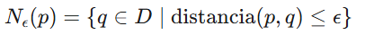
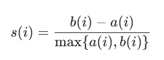

## Tarea #4
### Universidad de Ciencias Físico Matemáticas
#### Maestría en Ciencia de Datos - Aprendizaje Automático

## Alogritmo no supervisado

### DBSCAN (Density-Based Spatial Clustering of Applications with Noise) 

Es un potente algoritmo que agrupa puntos que están estrechamente cercanos en el espacio de datos. A diferencia de otros algoritmos de agrupamiento, DBSCAN no requiere especificar el número de clústeres de antemano. Sin embargo, Se requiere dominio de los inputs de este algoritmo los cuales son ϵ (vecinadrio) y MinPts. Realizar un cálculo incorrecto puede resultar en clústeres pobres.

El algoritmo funciona definiendo los clústeres como regiones densas separadas por regiones de menor densidad. Este enfoque permite a DBSCAN descubrir clústeres de forma arbitraria e identificar valores atípicos como ruido. También a diferencia de K-Means, en donde las formas de los clusters son esféricas, se puede tener formas arbitrarias.

La fórmula lógica de este método de clustering es la siguiente:

Donde:

+ D es el conjunto de todos los puntos de datos en tu dataset.

+ q∈D es cualquier punto de datos en el conjunto.

+ ϵ (Épsilon) es el radio máximo que define qué tan cerca deben estar dos puntos.

+ distancia(p,q) es una métrica de distancia utilizada (generalmente la distancia euclídea).

En términos sencillos, Nϵ(p) es el conjunto de puntos que se encuentran dentro de la esfera de radio ϵ centrada en p.

DBSCAN se basa en tres conceptos clave:

**Puntos centrales:** Son puntos que tienen al menos un número mínimo de otros puntos (MinPts) dentro de una distancia específica (ε o épsilon).

**Puntos límite:** Son puntos que se encuentran dentro de la distancia ε de un punto central, pero que no tienen MinPts vecinos.

**Puntos de ruido:** Son puntos que no son ni centrales ni fronterizos. No están lo suficientemente cerca de ningún clúster como para ser incluidos.

Para definir MinPts. la regla general es que debe de ser mayor o igual al doble de la dimensionalidad de los datos. 
Posteriormente se debe de calcular la k-distancia para cada punto p del conjunto de datos a todos los demás puntos, donde k es el valor de MinPts. 
Se ordenan las distancias de forma ascendente y se grafican
El valor de ϵ se elige en el punto donde la curva del gráfico forma un "codo" o punto de inflexión .

Conviene aplicar este modelo a mis datos porque identifica automáticamente los puntos que no pertenecen a ningún cluster, lo cual es útil para identificar resultados de carreras muy inusuales.

## Número de grupos en DBSCAN

Para calcular el Coeficiente de Silueta de un punto i, se necesitan dos valores: a(i) y b(i).

El Coeficiente de Silueta s(i) se calcula como:

Donde:

1. a(i) (Cohesión Intraclúster): Es la distancia promedio del punto i a todos los demás puntos dentro de su propio clúster.

+ Queremos que a(i) sea lo más pequeño posible.

2. b(i) (Separación Interclúster): Es la distancia promedio del punto i a todos los puntos en el clúster vecino más cercano (el clúster al que i no pertenece, pero cuya distancia promedio es mínima).

+ Queremos que b(i) sea lo más grande posible.

Si b(i)>a(i), entonces s(i) es positivo, lo que indica un buen agrupamiento.

En DBSCAN los puntos conocidos como puntos de ruido, generalmente se excluyen para este cálculo. Se debe considerar que está considerado para formas de clúster esféricas y DBSCAN no cuenta con esta característica; el resultado puede estar penalizado por esto.

El valor del Coeficiente de Silueta para un punto de datos individual varía entre -1 y +1.

+ Un valor cercano a +1 indica que el punto está bien agrupado y bien separado de los clústeres vecinos (alta cohesión y separación).

+ Un valor cercano a 0 indica que el punto está muy cerca de la frontera entre dos clústeres, siendo ambiguo su agrupamiento.

+ Un valor cercano a -1 indica que el punto ha sido asignado al clúster incorrecto, estando más cerca del centro de otro clúster.

El Puntaje de Silueta Promedio (Average Silhouette Score) es simplemente el promedio de los coeficientes de silueta de todos los puntos de la base de datos, y sirve como una métrica general para evaluar la partición completa.

